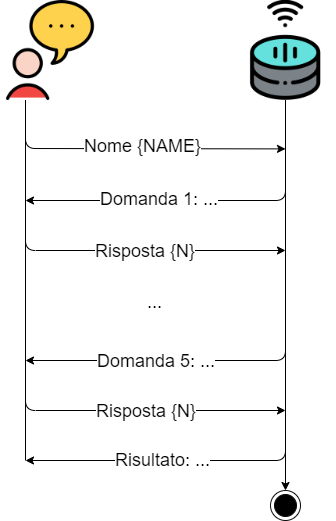

# alexa-workshop

## Initial setup
- Navigate to `./.ask` directory, copy `config.example` file and rename it to `config`
- Navigate to `./lambda/custom` directory and run `npm install` to install the dependencies listed in `package.json`

## Useful commands
- [ASK CLI](https://developer.amazon.com/it/docs/smapi/ask-cli-command-reference.html)
  - `ask deploy`: deploy the latest changes to AWS
- [BST CLI](http://docs.bespoken.io/en/latest)
  - `bst launch`: simulate a launch request
  - `bst utter <UTTERANCE> -m models/it-IT.json`: simulate an utterance

## Exercises
### Exercise 1
You must implement code for the following handlers:
- help
- start
- stop
- error

The following diagrams show the expected behavior for each handler.

  
*help*

  
*start*

  
*stop*

  
*error*

**Tips:**
- You must list all the intents in `models/it-IT.json`
- The `canHandle` method must return `true` if the handler should manage the user's request, `false` otherwise
- `handlerInput.requestEnvelope.request.type` is equal to `'IntentRequest'` if the request is an intent
- `handlerInput.requestEnvelope.request.intent.name` contains the name of the intent that matched the request (if any)
- You can close the session by passing `true` to the `withShouldEndSession` method

### Exercise 2
You must implement code for the following handler.

  
*question*

Alexa asks 5 different questions to the user.  
Each question has 4 options and the user can answer by saying "Risposta" followed by the number of the chosen option.  
The handler must keep track of the number of correct answers in order to communicate the result to the user at the end of the game.

**Tips:**
- `questions.json` is a sort of template for questions. It is up to you to use it or not.
- Variables in utterances are called slots. Each slot has a name and a [type](https://developer.amazon.com/it/docs/custom-skills/slot-type-reference.html). You must configure the slots in `models/it-IT.json`. Slots are stored in `handlerInput.requestEnvelope.request.intent`.
- In order to read and write session data you can use the following methods:
  - `handlerInput.attributesManager.getSessionAttributes`
  - `handlerInput.attributesManager.setSessionAttributes`
